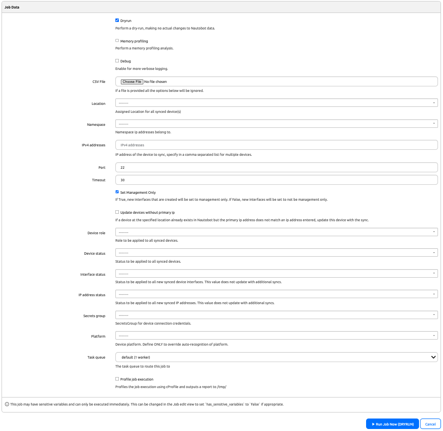

# Getting Started with the App

This document provides a step-by-step tutorial on how to get the App going and how to use it.

## Install the App

To install the App, please follow the instructions detailed in the [Installation Guide](../admin/install.md).

## First steps with the App

This App exposes an original device onboarding job, as well as two new SSoT based jobs that are considered the future of the App.

### Prerequisites

You will need:

- a device reachable from the Nautobot instance
    - this can an IP or DNS name
- the device's credentials
- to create a location in Nautobot

The device must be reachable from the Nautobot and Nautobot worker instances (usually if one can reach it, the other can as well). You can test reachability directly with ssh. Since the plugin uses Napalm and Netmiko, they could also be used for a more accurate test.

Locations are the only other Nautobot prerequisite for the plugin to onboard a device.

!!! info
    There are a few other requirements for the new SSoT based jobs, but can also support some defaults.

### Device Credentials Functionality

For a full explanation see the [ADR](../dev/arch_decision.md#handling-the-nornir-inventory)

The new SSoT based jobs each use their own Nornir inventories.

- `Sync Devices from Network` - A empty inventory for Nornir is instantiated and the Nautobot secrets group selected at the job execution is injected into the on-demand inventory creation.
- `Sync Data from Network` - Uses `nautobot-plugin-nornir` Nornir inventory plugin (the same one that Golden Config uses). This means you must have the following set in your nautobot_config PLUGIN_CONFIG section.

!!! warn
    Only the Nautobot Secrets credential provider (`CredentialsNautobotSecrets`) was implemented for the initial release of the plugin. `CredentialsEnvVars` and `CredentialsSettingsVars` are not supported currently.

```python
    "nautobot_plugin_nornir": {
        "nornir_settings": {
            "credentials": "nautobot_plugin_nornir.plugins.credentials.nautobot_secrets.CredentialsNautobotSecrets",
            "runner": {
                "plugin": "threaded",
                "options": {
                    "num_workers": 20,
                },
            },
        },
        "connection_options": {
            "netmiko": {
                "extras": {  # <==== passed into the connection setup.
                    "fast_cli": False,
                    "read_timeout_override": 30,
                },
            },
        },
    },
```
!!! info
    The main reason for mentioning this is that this has the possiblity of conflicting with Golden Config plugin settings if `CredentialsEnvVars` or `CredentialsSettingsVars` are in use. At this time the recommentation is to migrate to using Nautobot Secrets Groups, which is the general pattern Nautobot is moving towards into the future.

### Onboarding a Device

Navigate to the `Jobs` page from the nautobot navigation bar. Run `Sync Devices From Network` to get basic device and information onboarding, followed by `Sync Network Data From Network` to add additional details from the network to these devices. E.g. Interfaces, IPs, VRFs, VLANs.

## What are the next steps?

You can check out the [Use Cases](app_use_cases.md) section for more examples or try out the job inputs with at least the required fields.



The Nautobot job will pass the job execution to the worker which will initiate an onboarding and will reach out to the device and attempt to onboard it.
